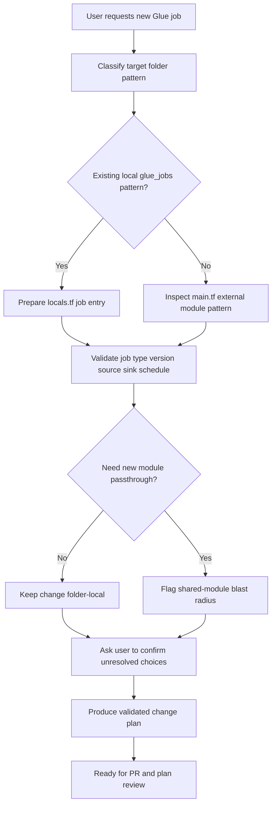
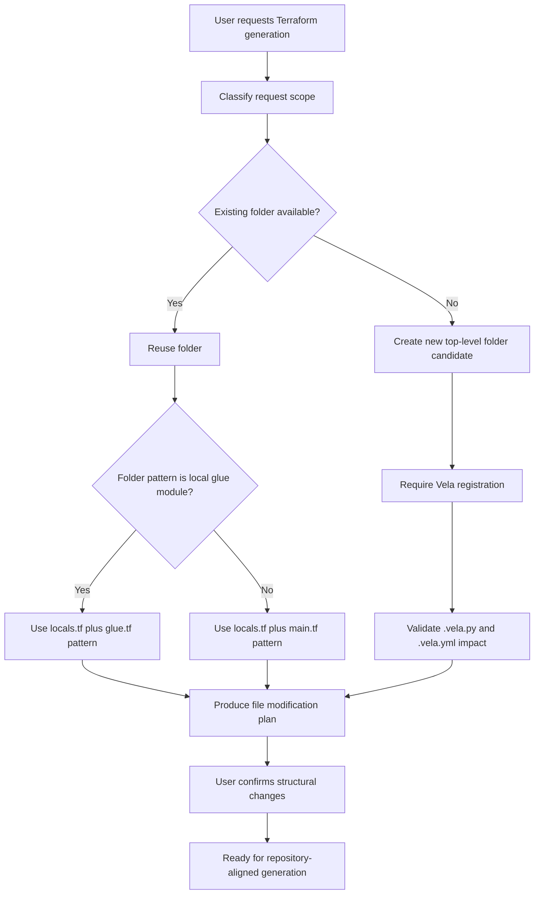
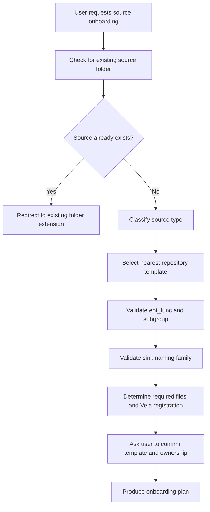
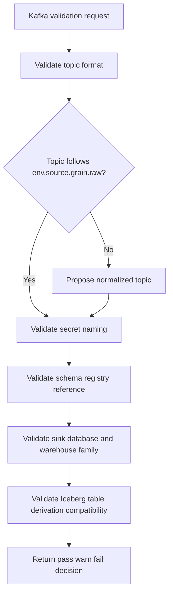
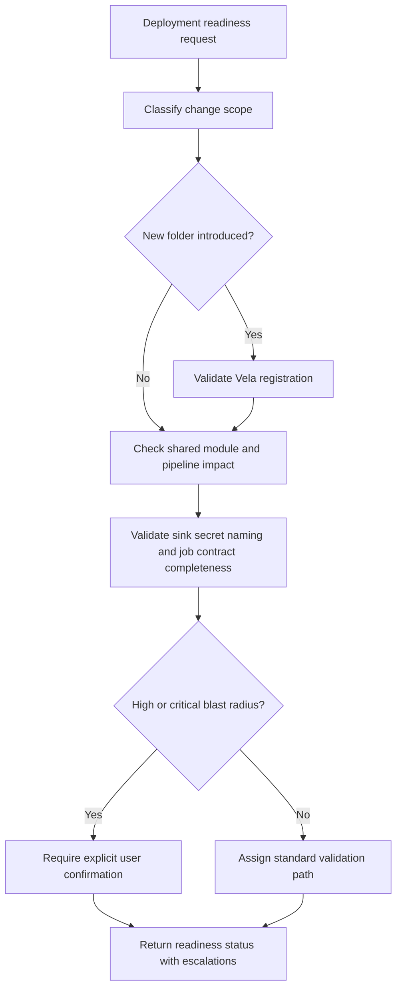

```
Using the repository documentation generated previously:

Design AI assistant workflows.

Generate:

1. Glue Job Creation Workflow
2. Terraform Generation Workflow
3. Source System Onboarding Workflow
4. Kafka Validation Workflow
5. Deployment Readiness Workflow

For each provide:

- Inputs
- Validation Steps
- Decision Points
- User Confirmation Steps
- Error Handling
- Success Flow

Generate Mermaid diagrams.

Generate Agent Design documentation.

Generate sample conversations.

Generate JSON schemas.

Do not generate implementation code.
```

# AI Assistant Workflow Design

## Purpose
This document designs AI assistant workflows for the repository using the repository documentation generated earlier. The workflows are aligned to the current repository conventions:

 

- folder-scoped Terraform deployment

- `locals.tf` as the main source-specific configuration layer

- `glue.tf` as the common module-wiring layer for many source folders

- `.vela.py` as the authoritative CI/CD definition source

- raw-layer Kafka and Iceberg ingestion as the dominant implementation pattern

- strong dependence on naming, validation, and blast-radius awareness

 

This is an agent design document. It does not define implementation code. It defines assistant behavior, workflow logic, user interaction points, validation expectations, and structured payload shapes.

 

---

 

## Agent Portfolio Overview

 

| Workflow | Primary Agent Role | Main Objective |

| --- | --- | --- |

| Glue Job Creation Workflow | Glue Job Design Agent | create or extend a job safely inside an existing repository pattern |

| Terraform Generation Workflow | Terraform Structure Agent | generate repository-aligned Terraform changes with minimal blast radius |

| Source System Onboarding Workflow | Source Onboarding Agent | create a new top-level source folder or source-family configuration |

| Kafka Validation Workflow | Kafka Contract Validation Agent | validate topic, schema, secret, sink, and naming coherence before change |

| Deployment Readiness Workflow | Deployment Readiness Agent | determine whether a change is ready for PR, merge, and deployment |

 

---

 

# 1. Glue Job Creation Workflow

 

## Agent Design

 

### Objective

 

Guide a user from a job request to a repository-valid Glue job definition that follows source-folder conventions, sink conventions, and module constraints.

 

### Agent Responsibilities

 

- classify the target folder pattern

- decide whether the change belongs in `locals.tf`, `glue.tf`, or shared modules

- validate job type, version, worker sizing, schedule, and source or sink contract inputs

- produce a safe update plan before file modification

- stop escalation to shared-module changes unless necessary

 

### Primary Guardrails

 

- prefer local source-folder changes over shared-module changes

- preserve existing naming family in the target folder

- require explicit confirmation before high-blast-radius changes

- require clear sink configuration before recommending deployment readiness

 

## Inputs

 

- target folder

- source system name

- job purpose

- job type

- job version

- source details

- sink details

- secret requirements

- worker sizing intent

- schedule requirement

- whether this is a new job or an extension of an existing pattern

 

## Validation Steps

 

1. Confirm the target folder exists and is already a deployable source boundary.

2. Determine whether the folder uses:

   - `glue.tf` plus `locals.tf`, or

   - `main.tf` plus `locals.tf`.

3. Confirm the requested job type is valid for the chosen pattern.

4. Validate the topic, secret, schema registry, database, warehouse, checkpoint, and role fields.

5. Compare worker settings to nearby jobs in the same folder.

6. Confirm whether `glue.tf` already passes the required inputs.

7. Determine whether the request can remain local to the folder.

 

## Decision Points

 

- Does the folder already support the requested job type?

- Is this only a new `glue_jobs` entry, or does module wiring need to change?

- Are worker overrides justified by precedent?

- Does the job belong in an existing folder, or is the user accidentally creating a new source boundary?

- Would this change require shared-module updates?

 

## User Confirmation Steps

 

- confirm the target folder is correct

- confirm the job should follow the existing naming family in that folder

- confirm sink database and warehouse target

- confirm worker override if different from local defaults

- confirm whether a shared-module change is acceptable if the local pattern cannot support the request

 

## Error Handling

 

- if the folder pattern is unclear, classify the folder before proposing edits

- if required sink fields are missing, stop and request the missing business inputs

- if job type is unsupported, offer supported alternatives rather than inventing a new type

- if the request implies a shared-module change, switch to high-risk mode and require explicit user acknowledgement

- if the job conflicts with existing naming conventions, propose the closest valid name

 

## Success Flow

 

Request received

→ Folder pattern classified

→ Job contract validated

→ Local vs shared scope determined

→ User confirms unresolved choices

→ Job definition plan produced

→ Repository-valid change prepared

→ Validation checklist produced

 

## Mermaid Diagram

 



 

## Sample Conversation

 

### Conversation A

 

**User:** I need a new Kafka-to-Iceberg job for `wahoo` for topic `dev.wahoo.multi-2.raw`.

 

**Assistant:** I found that `wahoo` uses the local `modules/glue_job` pattern with `glue.tf` plus `locals.tf`. The safest path is to add a new `glue_jobs` entry in `wahoo/locals.tf`. I need confirmation on five items: job version, schedule, sink database, sink warehouse path, and whether worker sizing should match the existing `multi-1` job.

 

**User:** Match `multi-1` for worker sizing and schedule. Use the same sink targets. Job version should be `0.3.0`.

 

**Assistant:** Understood. This remains a folder-local change. No shared-module update is needed. I will follow the existing `wahoo` naming family and validate topic, schema registry, secret name, and Iceberg target coherence.

 

## JSON Schema

 

### Request Schema

 

```json

{

  "$schema": "https://json-schema.org/draft/2020-12/schema",

  "title": "GlueJobCreationRequest",

  "type": "object",

  "required": [

    "targetFolder",

    "jobPurpose",

    "jobType",

    "jobVersion",

    "source",

    "sink"

  ],

  "properties": {

    "targetFolder": { "type": "string" },

    "jobPurpose": { "type": "string" },

    "jobType": {

      "type": "string",

      "enum": ["kafka_to_iceberg", "kafka_to_iceberg_batch", "unified", "unified_batch", "flat_file_to_iceberg"]

    },

    "jobVersion": { "type": "string" },

    "schedule": { "type": "string" },

    "workerProfile": {

      "type": "object",

      "properties": {

        "numberOfWorkers": { "type": "integer", "minimum": 1 },

        "workerType": { "type": "string", "enum": ["G.025X", "G.1X", "G.2X", "G.4X"] }

      },

      "additionalProperties": false

    },

    "source": {

      "type": "object",

      "required": ["mode"],

      "properties": {

        "mode": { "type": "string" },

        "topicName": { "type": "string" },

        "secretName": { "type": "string" },

        "schemaRegistryEndpoint": { "type": "string" }

      },

      "additionalProperties": true

    },

    "sink": {

      "type": "object",

      "required": ["database", "warehouse"],

      "properties": {

        "database": { "type": "string" },

        "warehouse": { "type": "string" },

        "checkpointDir": { "type": "string" },

        "assumeRoleArn": { "type": "string" }

      },

      "additionalProperties": true

    }

  },

  "additionalProperties": false

}

```

 

### Response Schema

 

```json

{

  "$schema": "https://json-schema.org/draft/2020-12/schema",

  "title": "GlueJobCreationResponse",

  "type": "object",

  "required": ["status", "scope", "validationResults", "nextActions"],

  "properties": {

    "status": { "type": "string", "enum": ["ready", "needs_confirmation", "blocked", "high_risk"] },

    "scope": { "type": "string", "enum": ["folder_local", "shared_module", "unknown"] },

    "filesLikelyModified": {

      "type": "array",

      "items": { "type": "string" }

    },

    "validationResults": {

      "type": "array",

      "items": {

        "type": "object",

        "required": ["rule", "result"],

        "properties": {

          "rule": { "type": "string" },

          "result": { "type": "string", "enum": ["pass", "warn", "fail"] },

          "message": { "type": "string" }

        },

        "additionalProperties": false

      }

    },

    "nextActions": {

      "type": "array",

      "items": { "type": "string" }

    }

  },

  "additionalProperties": false

}

```

 

---

 

# 2. Terraform Generation Workflow

 

## Agent Design

 

### Objective

 

Generate repository-aligned Terraform change designs while preserving folder-local scope, CI compatibility, and existing file-role conventions.

 

### Agent Responsibilities

 

- determine whether the user needs a new folder, a new Terraform entry, or a local update

- recommend the correct file set to change

- preserve the `locals.tf` versus `glue.tf` separation of concerns

- validate whether `.vela.py` and `.vela.yml` need updates

 

### Primary Guardrails

 

- do not create new top-level folders unless the source boundary is genuinely new

- do not change `.ci/common-files` or shared modules unless the requirement is cross-cutting

- avoid mixing external-module and local-module patterns in one folder without strong justification

 

## Inputs

 

- desired change type

- target source folder or proposed new folder

- selected Terraform pattern

- module source preference

- ownership metadata

- environment behavior assumptions

 

## Validation Steps

 

1. Determine if the request is folder-local or repository-structural.

2. Identify the nearest comparable existing pattern.

3. Validate whether required locals already exist.

4. Confirm whether `.vela.py` updates are required.

5. Confirm whether the requested Terraform entry keeps deployment scope local.

6. Evaluate whether the request introduces a shared dependency change.

 

## Decision Points

 

- existing folder versus new folder

- `main.tf` pattern versus `glue.tf` pattern

- local change versus shared module change

- source-folder-only change versus CI or pipeline change

 

## User Confirmation Steps

 

- confirm whether the user wants to reuse an existing source folder

- confirm which pattern should be copied from a neighboring source

- confirm whether Vela registration is expected

- confirm whether a structural repository change is acceptable

 

## Error Handling

 

- if the user proposes a new folder for an existing source family, recommend reuse of the current folder

- if the requested pattern conflicts with local convention, show the nearest valid pattern

- if required ownership metadata is missing, request `ent_func` and `subgroup`

- if the request implies a top-level deployment boundary change, explicitly mark it as structural

 

## Success Flow

 

Change request received

→ Scope classified

→ Comparable pattern selected

→ Required files identified

→ Structural validations completed

→ User confirms structural choices

→ Terraform generation plan produced

 

## Mermaid Diagram

 



 

## Sample Conversation

 

### Conversation B

 

**User:** I want to add Terraform for a new source called `mynewsource`.

 

**Assistant:** This looks like a new deployment boundary. I need to know whether `mynewsource` should follow the external Talaria module pattern or the local `glue_jobs` pattern. I also need `ent_func`, `subgroup`, and whether the source is Kafka, JDBC, staging, or something specialized.

 

**User:** It is Kafka-based and should behave like `wahoo`.

 

**Assistant:** Then the best repository-aligned design is a new top-level folder following the `locals.tf` plus `glue.tf` pattern used by `wahoo`, plus `.vela.py` registration and regenerated `.vela.yml`.

 

## JSON Schema

 

### Request Schema

 

```json

{

  "$schema": "https://json-schema.org/draft/2020-12/schema",

  "title": "TerraformGenerationRequest",

  "type": "object",

  "required": ["changeType", "targetScope"],

  "properties": {

    "changeType": { "type": "string", "enum": ["new_folder", "new_entry", "update_existing_entry", "shared_module_extension"] },

    "targetScope": { "type": "string" },

    "referencePattern": { "type": "string" },

    "ownership": {

      "type": "object",

      "properties": {

        "entFunc": { "type": "string" },

        "subgroup": { "type": "string" }

      },

      "additionalProperties": false

    },

    "requiresVelaRegistration": { "type": "boolean" }

  },

  "additionalProperties": false

}

```

 

### Response Schema

 

```json

{

  "$schema": "https://json-schema.org/draft/2020-12/schema",

  "title": "TerraformGenerationResponse",

  "type": "object",

  "required": ["status", "pattern", "filesToChange"],

  "properties": {

    "status": { "type": "string", "enum": ["ready", "needs_confirmation", "blocked", "structural_change"] },

    "pattern": { "type": "string", "enum": ["locals_glue", "locals_main", "specialized", "shared_module"] },

    "filesToChange": {

      "type": "array",

      "items": { "type": "string" }

    },

    "structuralNotes": {

      "type": "array",

      "items": { "type": "string" }

    }

  },

  "additionalProperties": false

}

```

 

---

 

# 3. Source System Onboarding Workflow

 

## Agent Design

 

### Objective

 

Guide a user from a source-system request to a repository-valid onboarding plan covering folder creation, ownership tagging, source-specific configuration, deployment registration, and validation.

 

### Agent Responsibilities

 

- determine whether the source is genuinely new

- map the source to the nearest existing template family

- define the onboarding file set

- enforce ownership and naming conventions

- ensure Vela registration is included when needed

 

### Primary Guardrails

 

- do not create a new source folder when an existing source family should be extended

- require ownership metadata before onboarding is considered complete

- prefer imitation of the nearest valid precedent over invention of a new pattern

 

## Inputs

 

- source system identifier

- source type

- business ownership

- target raw lakehouse design

- secret and connectivity model

- schedule requirements

- nearest comparable existing source folder

 

## Validation Steps

 

1. Confirm the source is not already represented by an existing folder.

2. Classify the source type: Kafka, JDBC, staging, flat file, or specialized task.

3. Choose the nearest existing source-folder template.

4. Validate `ent_func` and `subgroup` values.

5. Validate sink naming family and warehouse family.

6. Validate whether `.vela.py` and `.vela.yml` updates are required.

7. Confirm PR and deployment readiness artifacts are part of the onboarding plan.

 

## Decision Points

 

- new folder versus extend existing folder

- local shared module pattern versus external Talaria module pattern

- default ownership values versus governance exception

- standard raw sink family versus an already-established alternate family

 

## User Confirmation Steps

 

- confirm that the source system is truly new

- confirm the template folder the assistant should emulate

- confirm `ent_func` and `subgroup`

- confirm sink database and warehouse family

- confirm whether this onboarding includes only the source boundary or also the first Glue job

 

## Error Handling

 

- if a source already exists, redirect workflow to folder extension instead of onboarding

- if ownership is missing, hold the onboarding in incomplete state

- if the requested source type does not match any existing pattern, mark it as specialized and require extra confirmation

- if the naming family conflicts with source-family precedent, propose the closest consistent alternative

 

## Success Flow

 

Source request received

→ Existing source search completed

→ Pattern template selected

→ Ownership validated

→ File set defined

→ Vela registration decision confirmed

→ Onboarding plan approved

→ Repository-ready onboarding package produced

 

## Mermaid Diagram

 



 

## Sample Conversation

 

### Conversation C

 

**User:** I need to onboard a new source system called `abcsource`.

 

**Assistant:** I first need to determine whether `abcsource` should be a new top-level folder or an extension of an existing source family. What type of ingestion is it, and which existing folder is the closest match?

 

**User:** It is Kafka-based and closest to `yongyou`.

 

**Assistant:** Then I recommend using the `locals.tf` plus `glue.tf` pattern used by similar Kafka-based local-module folders. I still need `ent_func`, `subgroup`, sink database family, and whether the first Kafka topic should be included in the same onboarding request.

 

## JSON Schema

 

### Request Schema

 

```json

{

  "$schema": "https://json-schema.org/draft/2020-12/schema",

  "title": "SourceSystemOnboardingRequest",

  "type": "object",

  "required": ["sourceSystem", "sourceType"],

  "properties": {

    "sourceSystem": { "type": "string" },

    "sourceType": { "type": "string", "enum": ["kafka", "jdbc", "staging", "flat_file", "specialized"] },

    "nearestTemplate": { "type": "string" },

    "ownership": {

      "type": "object",

      "properties": {

        "entFunc": { "type": "string" },

        "subgroup": { "type": "string" }

      },

      "additionalProperties": false

    },

    "targetLakehouse": {

      "type": "object",

      "properties": {

        "database": { "type": "string" },

        "warehouse": { "type": "string" }

      },

      "additionalProperties": false

    }

  },

  "additionalProperties": false

}

```

 

### Response Schema

 

```json

{

  "$schema": "https://json-schema.org/draft/2020-12/schema",

  "title": "SourceSystemOnboardingResponse",

  "type": "object",

  "required": ["status", "recommendedPattern", "requiredFiles", "requiredConfirmations"],

  "properties": {

    "status": { "type": "string", "enum": ["ready", "needs_confirmation", "blocked", "duplicate_source"] },

    "recommendedPattern": { "type": "string" },

    "requiredFiles": {

      "type": "array",

      "items": { "type": "string" }

    },

    "requiredConfirmations": {

      "type": "array",

      "items": { "type": "string" }

    }

  },

  "additionalProperties": false

}

```

 

---

 

# 4. Kafka Validation Workflow

 

## Agent Design

 

### Objective

 

Validate Kafka-related onboarding or modification requests before file generation or deployment recommendation.

 

### Agent Responsibilities

 

- validate topic naming

- validate secret naming

- validate schema registry references

- validate source-to-sink naming coherence

- validate whether topic naming will remain compatible with Iceberg table derivation

 

### Primary Guardrails

 

- reject topic naming that breaks the repository’s raw naming contract without explicit exception handling

- require environment-consistent secret and endpoint references

- require sink database and warehouse consistency with the target folder

 

## Inputs

 

- topic name

- source folder

- source system

- Kafka secret name

- schema registry endpoint

- sink database

- warehouse path

- schema grain or business object

 

## Validation Steps

 

1. Validate topic structure against the dominant raw pattern.

2. Confirm the topic prefix aligns with the current environment.

3. Confirm the source-system segment aligns with the folder identity.

4. Confirm the schema-grain segment aligns with existing folder behavior.

5. Validate Kafka secret naming.

6. Validate schema registry endpoint source.

7. Validate sink database and warehouse naming family.

8. Validate compatibility with table-prefix derivation logic.

 

## Decision Points

 

- is the topic a standard raw topic or a naming exception?

- does the folder already contain similar topic shapes?

- should the secret follow existing folder-local convention or a subsystem-specific convention?

- does the sink family match the rest of the source folder?

 

## User Confirmation Steps

 

- confirm the topic grain or business object if ambiguous

- confirm whether a nonstandard topic name is intentional

- confirm sink naming family if multiple conventions are visible in comparable sources

- confirm whether schema registry is required for this topic’s transform pattern

 

## Error Handling

 

- if topic name is malformed, provide a normalized candidate

- if secret naming deviates from local precedent, show the folder-consistent alternative

- if schema registry is absent for a split or unpack pattern, mark the workflow as blocked

- if sink naming conflicts with local family, flag as high risk and require override confirmation

 

## Success Flow

 

Kafka contract request received

→ Topic validated

→ Secret validated

→ Schema registry validated

→ Sink validated

→ Table-derivation compatibility validated

→ Ready for Glue job creation or onboarding workflow

 

## Mermaid Diagram

 



 

## Sample Conversation

 

### Conversation D

 

**User:** Is `dev.saptcf.general_ledger` valid for this repository?

 

**Assistant:** It is not aligned to the dominant Kafka naming contract because it does not end with `.raw`. A normalized candidate would be `dev.saptcf.general_ledger.raw`, assuming `general_ledger` is the intended grain or business object. I also need to confirm whether the sink should remain in the `minerva_dev_src_corp_fin_sap_tcf_prd_raw_db` family.

 

## JSON Schema

 

### Request Schema

 

```json

{

  "$schema": "https://json-schema.org/draft/2020-12/schema",

  "title": "KafkaValidationRequest",

  "type": "object",

  "required": ["sourceFolder", "topicName"],

  "properties": {

    "sourceFolder": { "type": "string" },

    "topicName": { "type": "string" },

    "secretName": { "type": "string" },

    "schemaRegistryEndpoint": { "type": "string" },

    "sinkDatabase": { "type": "string" },

    "warehouse": { "type": "string" }

  },

  "additionalProperties": false

}

```

 

### Response Schema

 

```json

{

  "$schema": "https://json-schema.org/draft/2020-12/schema",

  "title": "KafkaValidationResponse",

  "type": "object",

  "required": ["overallResult", "checks"],

  "properties": {

    "overallResult": { "type": "string", "enum": ["pass", "warn", "fail"] },

    "normalizedTopicCandidate": { "type": "string" },

    "checks": {

      "type": "array",

      "items": {

        "type": "object",

        "required": ["name", "result"],

        "properties": {

          "name": { "type": "string" },

          "result": { "type": "string", "enum": ["pass", "warn", "fail"] },

          "details": { "type": "string" }

        },

        "additionalProperties": false

      }

    }

  },

  "additionalProperties": false

}

```

 

---

 

# 5. Deployment Readiness Workflow

 

## Agent Design

 

### Objective

 

Determine whether a repository change is ready for PR approval, merge, and deployment based on scope, validation completeness, and blast radius.

 

### Agent Responsibilities

 

- classify change blast radius

- confirm required files are updated consistently

- verify readiness for `plan`

- recommend validation depth before merge

- produce an operator-facing readiness status

 

### Primary Guardrails

 

- high-blast-radius changes require stronger user confirmation and broader validation

- structural CI changes require rendered-pipeline consistency

- source-folder changes are not marked ready until sink, secret, and schedule assumptions are coherent

 

## Inputs

 

- changed files

- affected folders

- scope classification

- whether `.vela.py` changed

- whether `.vela.yml` was regenerated

- whether shared modules changed

- whether the change includes new topics, new jobs, or new folders

- expected runtime impact

 

## Validation Steps

 

1. Classify the change as local, shared, structural, or operations-affecting.

2. Validate folder registration if a new folder is introduced.

3. Validate `.vela.py` and `.vela.yml` consistency if pipeline files changed.

4. Validate source-folder naming, sink naming, secret naming, and job contract completeness.

5. Validate blast radius against the change type.

6. Recommend validation depth:

   - standard

   - high

   - critical

7. Determine readiness state.

 

## Decision Points

 

- local folder change versus repository-wide change

- new folder versus existing folder

- shared-module update versus folder-local update

- pipeline change versus runtime configuration change

- ready now versus blocked pending confirmation or validation

 

## User Confirmation Steps

 

- confirm that the changed-file set is intentional

- confirm whether shared-module blast radius is acceptable

- confirm whether representative runtime validation is required

- confirm merge intent for critical-scope changes

 

## Error Handling

 

- if `.vela.py` changed without `.vela.yml` synchronization, mark as blocked

- if a new folder exists but is not in Vela registration, mark as blocked

- if a shared-module change lacks explicit blast-radius acknowledgement, mark as high risk

- if a job contract is incomplete, downgrade readiness to `needs_confirmation`

 

## Success Flow

 

Change set received

→ Scope classified

→ Structural validations completed

→ Contract validations completed

→ Validation depth assigned

→ User confirms any high-risk choices

→ Deployment readiness status returned

 

## Mermaid Diagram

 



 

## Sample Conversation

 

### Conversation E

 

**User:** Is this change ready to merge? I updated `modules/glue_job` and one source folder.

 

**Assistant:** Not yet ready for a standard merge path. This is a high-blast-radius change because `modules/glue_job` affects many folders. I recommend representative `plan` review across multiple folders and explicit confirmation that shared-module blast radius is intended.

 

## JSON Schema

 

### Request Schema

 

```json

{

  "$schema": "https://json-schema.org/draft/2020-12/schema",

  "title": "DeploymentReadinessRequest",

  "type": "object",

  "required": ["changedFiles"],

  "properties": {

    "changedFiles": {

      "type": "array",

      "items": { "type": "string" }

    },

    "affectedFolders": {

      "type": "array",

      "items": { "type": "string" }

    },

    "expectedImpact": { "type": "string" }

  },

  "additionalProperties": false

}

```

 

### Response Schema

 

```json

{

  "$schema": "https://json-schema.org/draft/2020-12/schema",

  "title": "DeploymentReadinessResponse",

  "type": "object",

  "required": ["readiness", "blastRadius", "requiredValidations"],

  "properties": {

    "readiness": { "type": "string", "enum": ["ready", "needs_confirmation", "blocked", "high_risk"] },

    "blastRadius": { "type": "string", "enum": ["local", "multi_folder", "repository_wide", "operations_wide"] },

    "requiredValidations": {

      "type": "array",

      "items": { "type": "string" }

    },

    "blockingReasons": {

      "type": "array",

      "items": { "type": "string" }

    },

    "recommendedNextSteps": {

      "type": "array",

      "items": { "type": "string" }

    }

  },

  "additionalProperties": false

}

```

 

---

 

# Cross-Workflow Confirmation Model

 

## Confirmation Levels

 

| Level | Meaning | Typical Use |

| --- | --- | --- |

| C1 | lightweight clarification | missing topic grain or schedule detail |

| C2 | structural confirmation | new folder, new pattern, or Vela registration change |

| C3 | high-risk confirmation | shared-module, pipeline, or JDBC core change |

| C4 | deployment confirmation | merge or rollout readiness acknowledgement |

 

## Confirmation Standard

 

An agent should prefer silent progress only for low-risk local-folder operations. It should always pause for confirmation when the request introduces:

 

- a new top-level folder

- a shared-module change

- a pipeline change

- a source-family naming exception

- a high-blast-radius deployment implication

 

---

 

# Agent Design Recommendations

 

## Recommended Interaction Pattern

 

For all workflows, the agent should follow this general structure:

 

1. classify scope

2. identify repository pattern

3. validate naming and contracts

4. surface decision points explicitly

5. collect only the missing confirmations

6. produce a structured readiness or action plan

 

## Recommended Output Modes

 

The assistant should support these output modes:

 

- concise checklist mode for experienced operators

- guided wizard mode for onboarding users

- risk-summary mode for PR reviewers

- readiness mode for deployment approvers

 

## Recommended Shared Knowledge Base Inputs

 

Each agent should consume the previously generated repository documentation, especially:

 

- repository conventions and onboarding patterns

- Terraform and Glue rules catalog

- deployment and operations analysis

- automation opportunities and validation catalogs

 

---

 

# Final Recommendation

 

The best assistant experience for this repository will come from workflow-aware agents that do not merely generate text, but instead:

 

- classify repository scope correctly

- preserve folder-local changes when possible

- escalate structural and shared changes intentionally

- enforce naming, sink, and secret conventions

- treat deployment readiness as a distinct decision rather than an afterthought

 

These five workflows together provide a practical operating model for an AI assistant that supports repository users from first request through deployment readiness without relying on unsafe free-form generation.


"Step","Naam","Kya banega"
"0","Application Repo Bootstrap","mif-infrastructure-copilot repo, folder skeleton, config, docker-compose, .env.example"
"1","Database Foundation","SQLAlchemy engine, async session, base, Alembic setup, connection verify"
"2","Models + Migrations","8 ORM models, migrations, constraints, indexes"
"3","Repository Layer","8 repositories, CRUD, optimistic locking, transactions"
"4","Knowledge Layer (registries + parsers)","JSON registries (aapke real repo values se!), HCL parsers, registry loader"
"5","Knowledge Layer (derivers + validators)","Derivers, validation engine, priority resolver"
"6","GitHub Service + OAuth","GitHub API integration, OAuth flow, token handling"
"7","Core Services","Draft, Snapshot, Session, Validation, Terraform, PR, Conflict services"
"8","LangGraph State + Nodes","GraphState, saare nodes, transitions, checkpointing"
"9","API Layer","FastAPI routes, middleware, DI container, agent endpoint"
"10","Frontend Foundation","React+Vite, three-pane layout, auth, routing"
"11","Frontend Chat + Workspace","Chat UI, widgets, review, diff viewer"
"12","Integration","End-to-end wiring, full flow"
"13","Testing","Unit, integration, contract, e2e, recovery, failure"
"14","Production Readiness","Logging, observability, security, deployment"